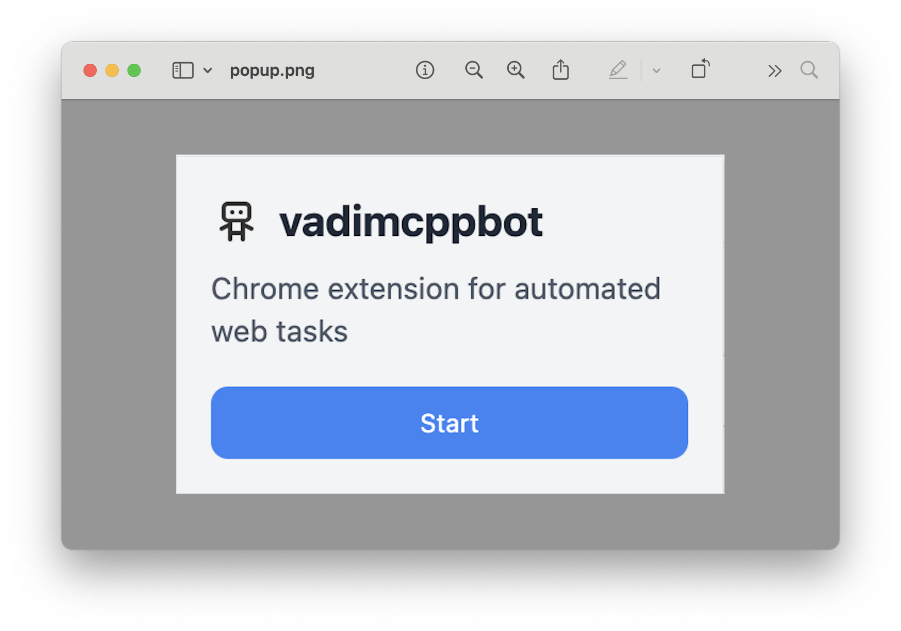
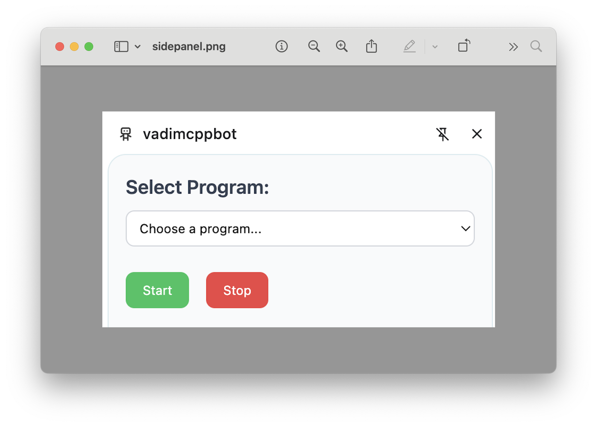
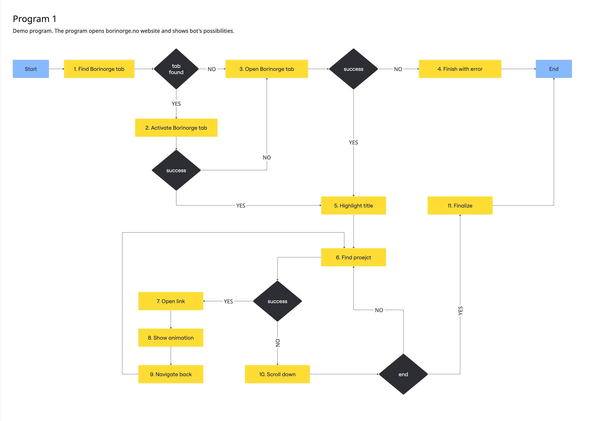

# Chrome Extension Bot

A Chrome extension built with TypeScript, Webpack, and Tailwind CSS.

## Quick start

1. Set up dependencies:
```bash
npm i
```

2. Build the extension:
```bash
npm run build
```

3. Upload to Chrome:
   - Open Chrome and navigate to `chrome://extensions/`
   - Enable "Developer mode" in the top right
   - Click "Load unpacked" and select the `dist` directory
4. Usage:
   - Open the extension popup
   
   - Press the "Start" button to open the side panel
   
   - Choose Program 1 and start it
   - The bot follows the scheme shown in the diagram below
   

## Features

- Modern UI with Tailwind CSS
- TypeScript support
- Webpack bundling
- Chrome Extension Manifest V3

## Project Structure

```
├── src/
│   ├── background.ts      # Background script
│   ├── content.ts         # Content script
│   ├── popup.html         # Extension popup
│   ├── popup.ts          # Popup script
│   ├── sidebar.html      # Sidebar HTML
│   ├── sidebar.ts        # Sidebar script
│   ├── styles.css        # Global styles
│   ├── manifest.json     # Extension manifest
│   ├── programs/         # Program-specific code
│   ├── types/           # TypeScript type definitions
│   ├── utils/           # Utility functions
│   ├── enums/           # Enumerations
│   └── classes/         # Class definitions
├── dist/                # Built extension files
└── test/               # Test files
```

## Prerequisites

- Node.js (Latest LTS version recommended)
- npm or yarn

## Installation

1. Clone the repository:
```bash
git clone [your-repository-url]
cd chrome-ext-bot
```

2. Install dependencies:
```bash
npm install
```

## Development

To start development with hot reloading:
```bash
npm run watch
```

To build the extension:
```bash
npm run build
```

## Loading the Extension in Chrome

1. Open Chrome and navigate to `chrome://extensions/`
2. Enable "Developer mode" in the top right
3. Click "Load unpacked" and select the `dist` directory

## Technologies Used

- TypeScript
- Webpack
- Tailwind CSS
- Chrome Extension APIs
- PostCSS
- CSS Loaders

## Scripts

- `npm run build` - Build the extension
- `npm run watch` - Watch for changes and rebuild
- `npm test` - Run tests (currently not configured)

## License

ISC

## Contributing

1. Fork the repository
2. Create your feature branch (`git checkout -b feature/amazing-feature`)
3. Commit your changes (`git commit -m 'Add some amazing feature'`)
4. Push to the branch (`git push origin feature/amazing-feature`)
5. Open a Pull Request 